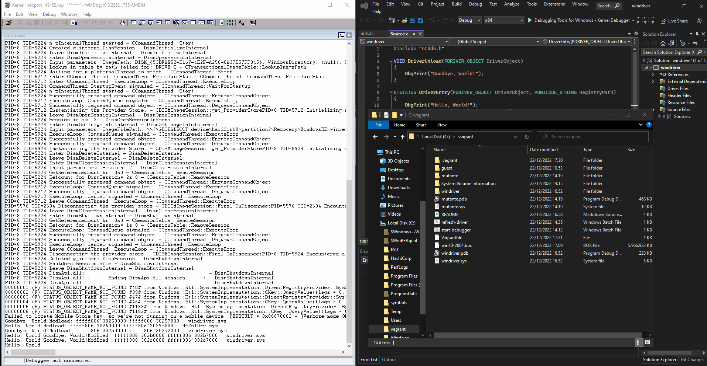

# Driver development setup

This project helps set up driver development through the use of Vagrant to speed
up the kernel driver debugging process.



Tested to work with

* Windows 10 version 22H2
* Windows 10 version 2004

Follow the steps in the sections below to get started.

## Visual Studio setup
* Download the *newest* version of Visual Studio and ensure the *latest* are
  installed:

  Workloads:
  * Desktop development with C++
  * Windows application desktop

  Individual components:
  * MSVC vXX - VS 20XX C++ x64/x86 build tools (Latest)
  * MSVC vXX - VS 20XX C++ x64/x86 Spectre-mitigated libs (Latest)
  * Install the newest Windows SDK
  * Install the newest WDK (VS *must* be installed first)
    * Install from <https://learn.microsoft.com/en-us/windows-hardware/drivers/download-the-wdk>

  > NOTE: The libraries can be installed from the VS installer or, by visiting
  > [learn.microsoft.com](https://learn.microsoft.com/en-us/windows-hardware/drivers/download-the-wdk).

  > NOTE2: Ensure that your project from where you compile the driver is
  > outputting its .sys file into `C:\kernel-debugging` (in VS, go to Debug ->
  > Debug Properties -> Output Directory)

## Download/clone this repository

1) Download or git clone this repo: `git clone
   git@github.com:christianshub/kernel-debugging.git` and place it at
   `C:\kernel-debugging`. This step is important, as certain batch files expects
   this exact path.

## VM Base Box Creation

1) Download a Windows .iso image at
   [microsoft.com](https://www.microsoft.com/da-dk/software-download/windows10)

    > Older, specific, versions can be downloaded through the use of
    > [rufus](https://rufus.ie/en/)

2) Download and install [VirtualBox](https://www.virtualbox.org/) and create a
   VM named `win10-base` - apply the downloaded .iso file. Specifications:

    * 50 GB HDD
    * Username: vagrant
    * Password: vagrant

3) Power up the VM and follow the [vagrant
   docs](https://developer.hashicorp.com/vagrant/docs/boxes/base#Windows%20Boxes),
   also listed in detail below:

  * Install the guest tools:
    * Go to Devices in the top pane -> Insert Guest Addition Image and run
      installer
    * Go to Devices in the top pane -> Upgrade Guest additions

  * Copy `guest-setup.bat` into the VM and run it (elevated) to
    * Enable Kernel Debug Print
    * Allow Remote Management using WinRM
    * Set network to Private
    * Disable User Account Control
    * Disable firewall
    * Disable windows auto login
    * Disable automatic updates (optional)
    * Disable security (optional)

## Running the environment

### Create and start the vagrant box from scratch

1) (One-time) Ensure vagrant is [downloaded and
   installed](https://developer.hashicorp.com/vagrant/downloads)

1) (One-time) Ensure the base-VM is powered off.

1) (One-time) Open up Powershell on the host PC:

    ```vagrant
    cd C:\kernel-debugging
    vagrant package --base Win10 --output win10.box
    vagrant box add win10 win10.box
    ```

    `Win10` is the name of the newly created VM (it may have a different name in
    your situation). `win10.box` is the vagrant VM box name.

1) Edit `guest/kdbg.bat` so that `hostip` reflects your private IP.
1) Now double-click on `start-debugger.bat`

   > To shutdown the vagrant box close WinDbg.

Note: To remove boxes do:

  ```vagrant
  vagrant box list
  vagrant box remove <name.box>
  ```

The box can now be recreated.

### Refresh driver

In case the vagrant-VM is up and running, then simply refresh the driver by
running `refresh-driver.bat`.

### Full vagrant VM reset

To fully reset the vagrant-VM ensure the `C:\kernel-debugger\.vagrant` folder is
removed. After this, `start-debugger.bat` can be rerun.

## Resources

Based on the great article and code from
https://secret.club/2020/04/10/kernel_debugging_in_seconds.html

## Troubleshoot

### The vagrant process is shutting down immediately

Do a `vagrant box list` and ensure the vagrant box was created.

## Known issues

### Task may stop if host machine runs on battery

* If the host machine (laptop) is ran on battery, the scheduled tasks may stop
  to work (see issue
  [here](https://stackoverflow.com/questions/9075564/change-settings-for-power-for-windows-scheduled-task)).
  * Potential workaround: Use Powershells `New-ScheduledTaskSettingsSet` which
    has a -AllowStartIfOnBatteries parameter.
  * Workaround: For laptops, ensure its in a charger.

### Currently not possible to restart shutdown vagrant VM.

* Working on fix.
